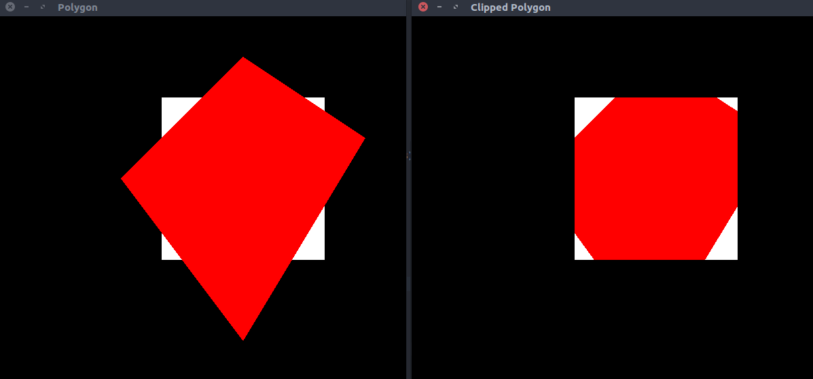

# Cohen - Hodgeman polygon clipping algorithm
> Program to implement the Cohen - Hodgeman polygon clipping algorithm

### Compile

#### For linux
```
$ g++ polygon_clipping.cpp -lGL -lGLU -lglut -o polygon_clipping.o
```

#### For macOS
```
g++ polygon_clipping.cpp -framework OpenGL -framework GLUT -o polygon_clipping.o
```

### Run

#### Example 1
```
$ ./polygon_clipping.o
```


