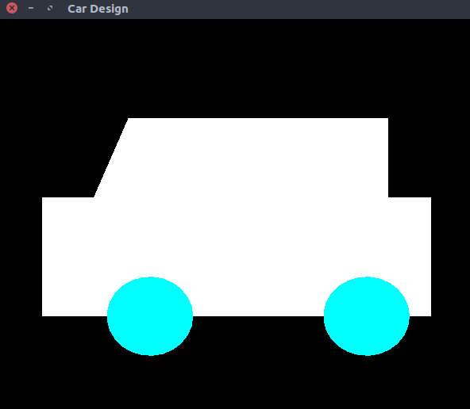

# Car Design
> Program to generate a car design using display list

### Compile

#### For linux
```
$ g++ car_design.cpp -lGL -lGLU -lglut -o car_design.o
```

#### For macOS
```
g++ car_design.cpp -framework OpenGL -framework GLUT -o car_design.o
```

### Run

#### Example 1
```
$ ./car_design.o
```


