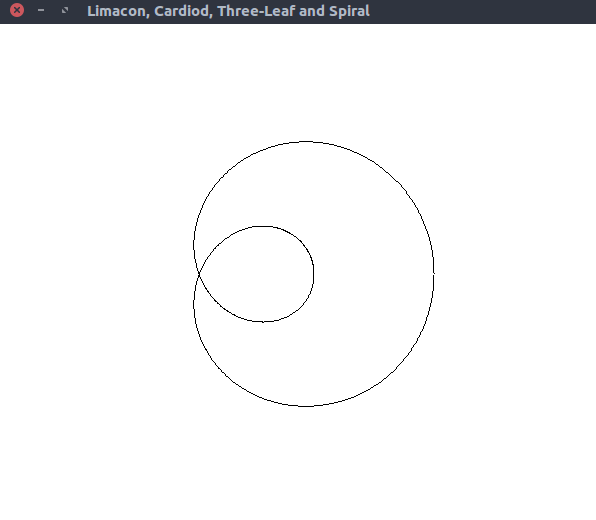
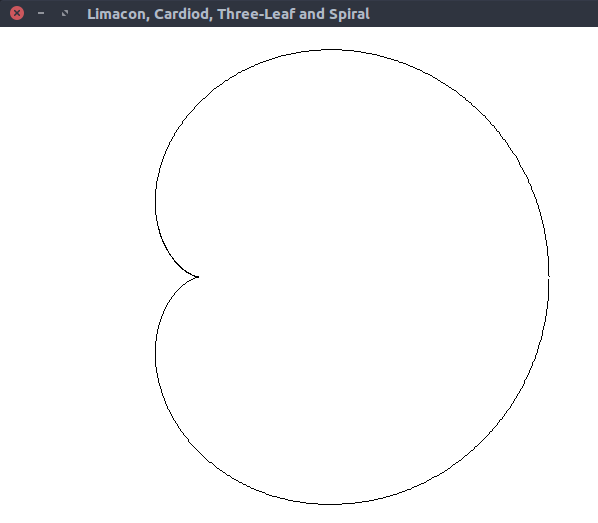
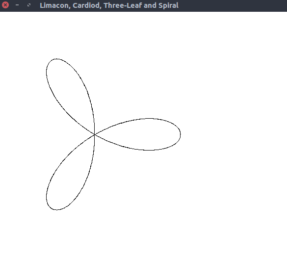
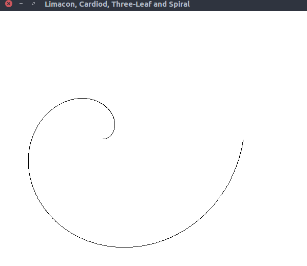

# Limacon, Cardiod, Three-Leaf and Spiral
> Program to generate a Limacon, Cardiod, Three-Leaf and Spiral curve

### Compile

#### For linux
```
$ g++ lima_card.cpp -lGL -lGLU -lglut -o lima_card.o
```

#### For macOS
```
g++ lima_card.cpp -framework OpenGL -framework GLUT -o lima_card.o
```

### Run

#### Example 1
```
$ ./lima_card.o
1. Limacon
2. Cardiod
3. Three-Leaf
4. Spiral
Enter user choice : 1
```



#### Example 2
```
$ ./lima_card.o
1. Limacon
2. Cardiod
3. Three-Leaf
4. Spiral
Enter user choice : 2
```



#### Example 3
```
$ ./lima_card.o
1. Limacon
2. Cardiod
3. Three-Leaf
4. Spiral
Enter user choice : 3
```



#### Example 4
```
$ ./lima_card.o
1. Limacon
2. Cardiod
3. Three-Leaf
4. Spiral
Enter user choice : 4
```


