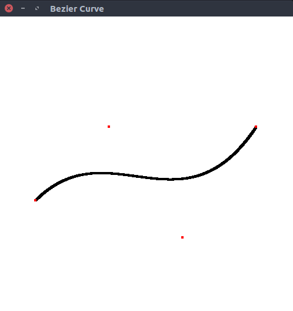
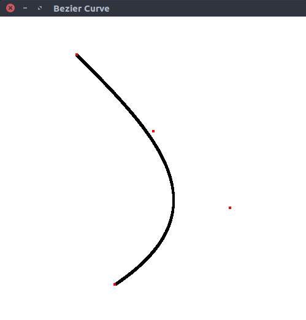

# Bezier Curve
> Program to construct **Bezier curve**. Control points are supplied through keyboard

### Formula

 Bezier curve formula for points P0(x0, y0), P1(x1, y1), P2(x2, y2) and P3(x3, y3)


### Compile

#### For linux
```
$ g++ bezier_curve.cpp -lGL -lGLU -lglut -o bezier_curve.o
```

#### For macOS
```
g++ bezier_curve.cpp -framework OpenGL -framework GLUT -o bezier_curve.o
```

### Run

#### Example 1
```
$ ./bezier_curve.o
Enter x coordinates :
100 300 500 700
Enter y coordinates :
300 500 200 500
```

    

#### Example 2
```
$ ./bezier_curve.o
Enter x coordinates :
300 600 400 200
Enter y coordinates :
100 300 500 700
```


