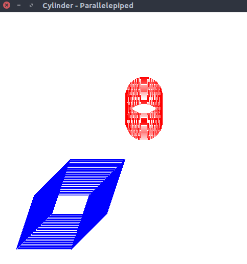

# Cylinder - Parallelepiped
> Program to create a cylinder and parallelepiped by extruding a circle and quadrilateral respectively

### Compile

#### For linux
```
$ g++ cylinder.cpp -lGL -lGLU -lglut -o cylinder.o
```

#### For macOS
```
g++ cylinder.cpp -framework OpenGL -framework GLUT -o cylinder.o
```

### Run

#### Example 1
```
$ ./cylinder.o
```

    
