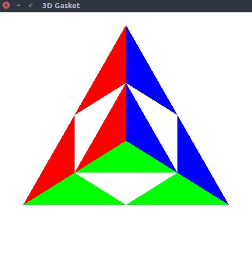
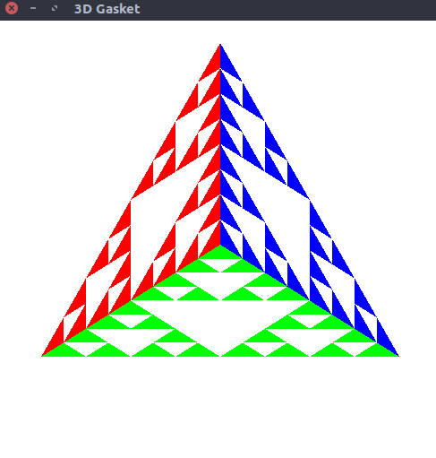
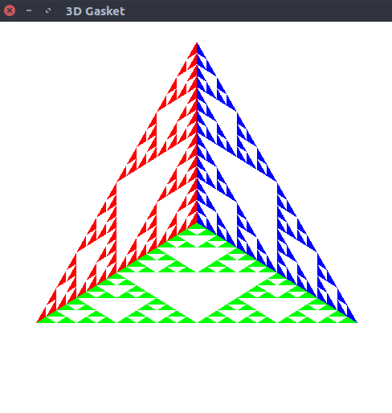

# 3D Sierpinski gasket
> Program to recursively subdivide a tetrahedron to form 3D Sierpinski gasket

### Compile

#### For linux
```
$ g++ gasket.cpp -lGL -lGLU -lglut -o gasket.o
```

#### For macOS
```
g++ gasket.cpp -framework OpenGL -framework GLUT -o gasket.o
```

### Run

#### Example 1 (n = 1)
```
$ ./gasket.o
```



#### Example 2 (n = 2)
```
$ ./gasket.o
```


#### Example 3 (n = 3)
```
$ ./gasket.o
```



#### Example 4 (n = 4)
```
$ ./gasket.o
```


