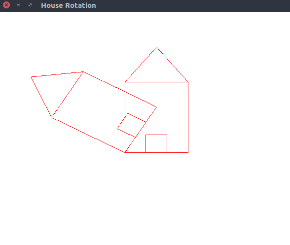

# House rotate
> Program to create a house like figure and rotate it about a given fixed point using OpenGL functions

### Compile

#### For linux
```
$ g++ house_rotate.cpp -lGL -lGLU -lglut -o house_rotate.o
```

#### For macOS
```
g++ house_rotate.cpp -framework OpenGL -framework GLUT -o house_rotate.o
```

### Run

#### Example 1
```
$ ./house_rotate.o
Enter the rotation angle : 60
Enter the pivot point position : 100 100
```

    
