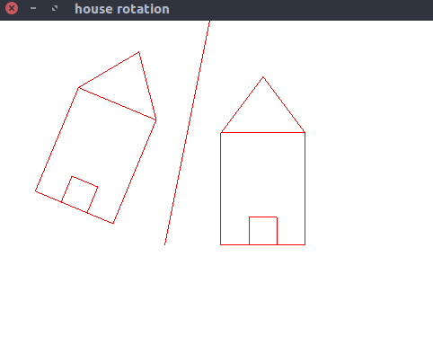

# House reflect
> Program to create a house like figure and reflect it about an axis defined by y = mx + c using OpenGL transformation functions

### Compile

#### For linux
```
$ g++ house_reflect.cpp -lGL -lGLU -lglut -o house_reflect.o
```

#### For macOS
```
g++ house_reflect.cpp -framework OpenGL -framework GLUT -o house_reflect.o
```

### Run

#### Example 1
```
$ ./house_reflect.o
Enter the slope(m) and intercept(c): 5 100
```

    
