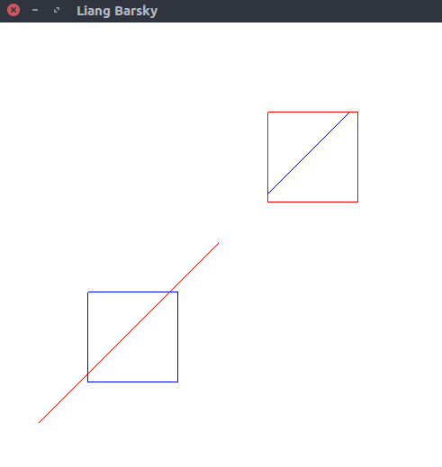
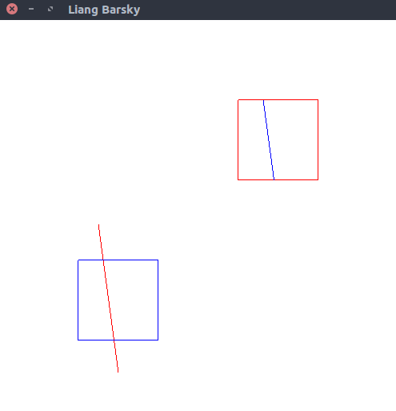

# Cohen-Sutherland line clipping
> Program to implement **Cohen-Sutherland** line clipping algorithm.

### Compile

#### For linux
```
$ g++ cohen_sutherland.cpp -lGL -lGLU -lglut -o cohen_sutherland.o
```

#### For macOS
```
g++ cohen_sutherland.cpp -framework OpenGL -framework GLUT -o cohen_sutherland.o
```

### Run

#### Example 1
```
$ ./cohen_sutherland.o
Enter end points, P1(x1, y1) and P2(x2, y2): 45 55 245 255
```

  

#### Example 2
```
$ ./cohen_sutherland.o
Enter end points, P1(x1, y1) and P2(x2, y2): 125 245 150 60
```


